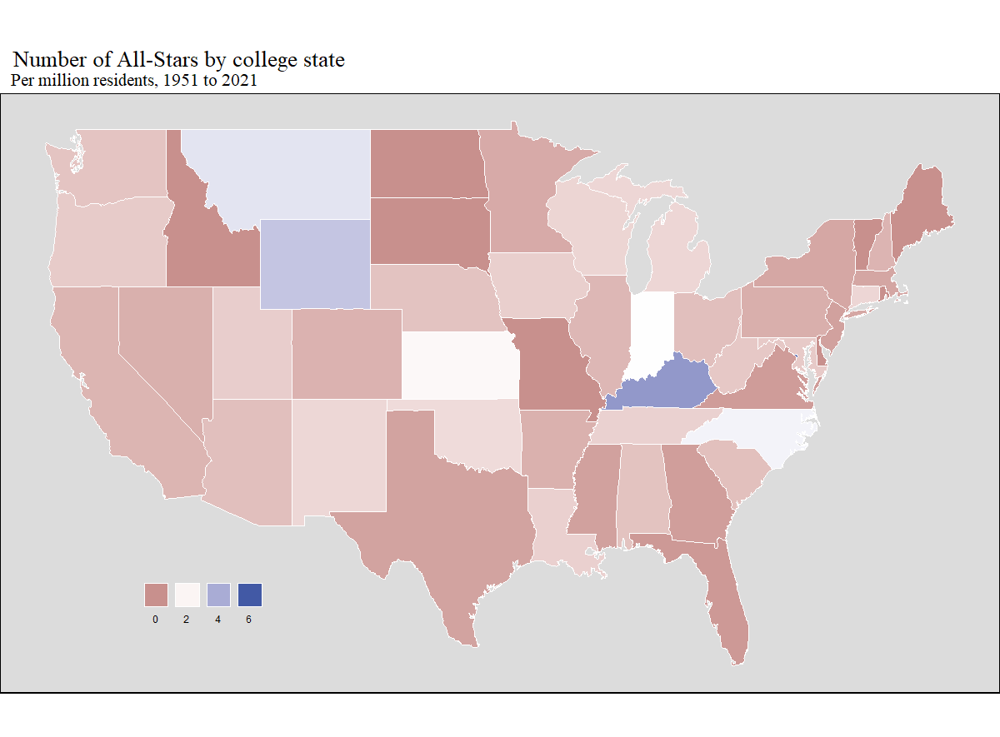

Project 2: NBA All-Stars
================
Data Wranglers

Our Shiny App can be found
[here](https://ohenry34.shinyapps.io/data-wranglers/). Our source code
can be found
[here](https://github.com/vizdata-f21/project-2-data_wranglers) (the
[shiny
folder](https://github.com/vizdata-f21/project-2-data_wranglers/tree/main/shiny),
specifically, holds our code, while Shiny.R is our complete App). Link
if the hyperlink doesn’t work:
<https://github.com/vizdata-f21/project-2-data_wranglers>.

A link to a screen recording for our presentation can be found [here
(YouTube)](https://youtu.be/XccwwLk0Ssc).

# Introduction

The NBA is an increasingly global league where its top talent comes from
countries all over the world and colleges around the United States.
As fans of basketball, we were very interested in looking at which teams All-Stars
played for, where they were drafted, and how many
NBA All-Stars (or the NBA’s best players) come from countries other than
the United States and how international talent has grown over the years.
This could also be used by NBA scouts and general managers to see how important
international scouting is and whether they should focus a lot of their
attention going into an NBA draft on foreign players.

Additionally, as Duke and college basketball fans, we wanted to explore
which colleges had the most NBA All-Stars and which states had the most
colleges with top NBA talent too. Our Shiny App enables users to analyze which colleges are
most useful in producing NBA All-Star players, and where these colleges
are found.

# Data

This data comes from [Basketball
Reference](https://www.basketball-reference.com/), [Real
GM](https://basketball.realgm.com/),
[Wikipedia](https://en.wikipedia.org/wiki/Module:College_color/data),
[The United States Census
Bureau](https://www.census.gov/programs-surveys/popest/technical-documentation/research/evaluation-estimates/2020-evaluation-estimates/2010s-totals-national.html),
& [The United States Department of
Education](https://data.ed.gov/dataset/college-scorecard-all-data-files-through-6-2020/resources).
Data from Wikipedia, Basketball Reference, and RealGM was scraped by us.
Prior to scraping data, we verified using the `robots.txt` file that the
data was scrape-able.

# Research Questions

1.  Which colleges did the most NBA All-Star players attend?
    Geographically, which regions in the US are those colleges in that
    produce the most NBA All-Star players?

2.  What proportion of NBA All-Stars were drafted in the first round of
    the NBA draft? Which teams did these All-Stars play for?

3.  Where are NBA All-Stars originally from geographically? How many
    All-Stars, have there been from outside the United States per
    year? Which states have produced the most all stars per capita?

# NBA All-Stars by College

Our first research question was primarily motivated by our group members
being Duke basketball fans and fans of college basketball as a whole. We
wanted to do a deeper dive into relationships between college basketball
teams and NBA player success. In our analysis, we defined a player’s
college as being the place that they attended immediately prior to
starting their NBA career, regardless of whether they graduated.

In our Shiny App, we explored these relationships in the first three
tabs: the “Colleges”, “College Map”, and “College State” tabs.

In the “Colleges” tab, we created a dynamic racing bar chart that
measures the amount of All-Stars a college has produced since the
introduction of the All-Star game in 1951. We allow the user to define
whether they would like to count every appearance made in an All-Star
game or to only count each player once per college, even if they made
several All-Star games. We have other user options as well, as shown below.

<figure>
<figcaption aria-hidden="true">“Colleges” tab user interface</figcaption>
</figure>

To give us a broad sense of what colleges have been most successful in
producing All-Star NBA players, we chose to plot the number of All-Star
game appearances over time by college, yielding the result that
Kentucky, UCLA, and UNC are the leaders of the pack.

One thing I should point out here is the use of University colors to
give the plot more life (which took way more effort than I had
anticipated).

<figure>
<figcaption aria-hidden="true">Total All-Star appearances by college, 1951-2021</figcaption>
</figure>

To account for the fact that some players may have accounted for many
All-Star appearances, we then limit the query to count just the number
of players who have made an All-Star game, rather than the total amount
of appearances. Unsurprisingly, this plot shows similar results, however
Duke does leap UNC in cumulative All-Star players, undoubtedly due to
the fact that Michael Jordan’s 14 appearances in the prestigious game
are only counting as one tally in UNC’s column here.

<figure>
<figcaption aria-hidden="true">All-Star players by college, 1951-2021</figcaption>
</figure>

One aspect of this data that we were keen to explore was the recent
years. In 2006, the NBA instituted the “One-and-Done” rule, requiring
players to be one year removed from high school before entering the NBA
draft. This meant elite high school basketball players would be
significantly more likely to spend at least one year in college prior to
joining the NBA, contrasting the trend of players joining the NBA
immediately following high school that had persisted in years prior. In
the wake of this rule, colleges like Kentucky and Duke elected to pursue
these elite athletes, valuing their basketball ability highly and
dismissing concerns about the lack of continuity that would result from
players coming and going yearly.

We chose to plot the same data as previously, limiting the starting year
to be 2007, which was the first All-Star that “One-and-Dones” were in
the NBA for.

<figure>
<figcaption aria-hidden="true">Total All-Star appearances by college, 2007-2021</figcaption>
</figure>

<figure>
<figcaption aria-hidden="true">All-Star players by college, 2007-2021</figcaption>
</figure>

In both total All-Star game appearances and number of players with an
All-Star appearance, Kentucky has dominated the “One-and-Done” era,
offering evidence for our hypothesis. Duke has had six All-Star players
in the same era, good enough for second place. The effect of one
dominant player can be seen clearly in the first chart, with Texas’
Kevin Durant’s 11 All-Star game appearances propelling Texas to a second
place finish in the timespan. Kevin Durant was a “One-and-Done” player,
drafted second overall in the 2007 NBA draft.

To find where NBA players attended colleges geographically, we plotted
both a chloropleth map of states and a point location map showing where
players have attended. Customizability for the user in the Shiny App is
shown below.

<figure>
<figcaption aria-hidden="true">“Colleges Map” tab user interface</figcaption>
</figure>

<figure>
<figcaption aria-hidden="true">“College State” tab user interface</figcaption>
</figure>

We chose to use our Shiny App to examine the geography of where NBA
All-Stars have gone to college over time.

<figure>
<figcaption aria-hidden="true">Map of All-Star players’ college locations, 1951-2021</figcaption>
</figure>

We then chose to look on a bigger scale, comparing across states. To
avoid problems that arise with red-green colorblindness, we chose a
blue-red color palette, using the NBA logo’s colors for guidance.

<figure>
<figcaption aria-hidden="true">All-Star players’ college locations by state, 1951-2021</figcaption>
</figure>

California, North Carolina, and Kentucky stand out most among states.
However, because states with many people in them would be more likely to
have NBA All-Star players attend college there, we wanted to standardize
states for comparison by population.

<figure>
<figcaption aria-hidden="true">All-Star players’ college locations by state (per million residents), 1951-2021</figcaption>
</figure>

After normalizing states, Kentucky and North Carolina are still among
the leaders. These states feature heralded basketball programs from
which many great NBA players have emerged. Wyoming and Montana also
stand out, but their values are more a product of their minuscule
populations.

# NBA All-Stars by Draft, Team

For our second question, we wanted to see how important early picks in
the NBA draft are for finding the best players. We created an animated,
racing bar chart to illustrate the number of All-Stars that were drafted
in the first round, second round, or went undrafted and how that has
shifted over the years. This could be used by NBA front offices to
determine how important a first round pick is and how much a second
round pick is really worth in trade scenarios. It was also interesting
for us to look at how many undrafted All-Stars there have been, as we
hypothesized that would be a very small percentage of the NBA’s top
talent.

Another hypothesis we had was that a lot of the NBA’s top talent comes
from the same few organizations over the years (such as the Boston
Celtics and LA Lakers). We were interested in exploring the number of
All-Stars per team over the years to draw conclusions on the
distribution of talent in the NBA.

We also wanted to see which teams have had the most cumulative All-Star
selections, so we created an interactive plot to address the second part
of this research question. This was interesting for our group as we
hypothesized that there would be a significant difference in the number
of All-Stars from larger markets (like Los Angeles, New York, and Miami)
versus small market cities (such as Memphis or Minneapolis). We wanted
to analyze if the location of cities plays a significant in attracting
“All-Star” talent to the same few teams.

First, for the “Draft Positions” tab to clean up the data I had to
create a new variable called “draft\_range” that used the str\_detect
function to determine whether each NBA All-Star was a first round pick,
second round pick, or went undrafted. I also created a new variable
called “sum\_all\_stars” which I used to count how many All-Stars there
were from draft category each year.

Our Shiny App displays the distribution of which NBA draft picks
cumulatively (over a range of years) are from each round of the draft or
are undrafted. The distribution over the full range of years is
illustrated below:

<figure>
<figcaption aria-hidden="true">All-Star appearances by draft round</figcaption>
</figure>

As you can see above, from 1951 to 2021 there have been significantly
more total All-Star appearances from first round picks compared to both
second round picks and undrafted players. There have been \~1300
cumulative first round pick All-Star selections compared to \~200 from
the secound round and \~150 undrafted All-Stars. This distribution
demonstrated the importance of earlier draft picks as this plot shows
that over 75% of All-Star selections come from the first round of the
draft. This outcome could encourage the idea of “tanking” as, if bad
teams lose on purpose, they could get earlier draft picks. However,
despite the large majority of All-Star selections being from the first
round, second round picks are often basically traded away for little to
no value and do not hold much trade value. Our group concluded that NBA
general managers should still hold some value on those picks, as, we
felt that the distribution is large enough to demonstrate that those
picks are worth holding onto. We concluded that it is also worth it for
teams to consider picking up undrafted players, they are almost 10% of
the NBA’s All-Stars over the last 70 years and are often on much smaller
contracts and are, therefore, low risk investments. However, more
recently (as you can see by adjusting the range of years on the app) the
proportion of second round picks and undrafted All-Star selections has
decreased. For example, since 2010 there has not been any undrafted
All-Star selections, which could signify that NBA teams are doing a
better job drafting and undrafted players have less value than they did
previously.

Next, for the “Team” tab, we looked at the distribution of total
All-Star appearances for each team over a range of years. First, as many
teams have changed cities and/or names over the course of the last 70
years, I used the mutate variable to rename each team by their current
name and city. For example, the Los Angeles Lakers used to be the
Minneapolis Lakers, so I used the mutate function so the total All-Stars
would all be shown under the name “Los Angeles Lakers”. I also,
similarly, created a new variable called “sum\_all\_stars” which I used
after using the pivot functions to count how many All-Stars there were
from draft category each year. Finally, for this chart I added a
variable called “number\_to\_rank” that would allow the user to choose
the number of teams he wants displayed. The default is set at all 30
teams, but if the user wanted a closer look at the teams with the most
All-Stars, you could change the teams to range to 10, for example, and
the app would only display the teams with the 10 most All-Stars
cumulatively each year. The distribution over the full range of years is
illustrated below:

As you could see in the plot above, the larger market teams (from
bigger, more attractive cities) have had pretty significantly more
All-Star selections than most of the smaller market teams. Four of the
top five teams with the most total All-Star appearances are from bigger
markets in Boston, LA, Philadelphia, and New York. The teams with the
lowest amount of total All-Star appearances are from smaller market
cities, including Memphis, Charlotte, New Orleans, and Minnesota.

The total All-Star appearances could be explained by bigger markets, but
also by managers building successful teams that resulted in more
championships. The Lakers and Celtics have not only had the most
All-Stars but they have had the most NBA championships. This is likely
due to a combination of team and draft success, as well as their cities
being attractive enough to bring in the best NBA players.

# NBA All-Stars by Birthplace

Our third research question was motivated by a curiosity to not only understand
the recent surge in international talent in the NBA, but also to identify which
states were more likely to produce an NBA All-Star than others.

The tabs in our shiny app that correspond to this question are the "World Map"
tab and the "U.S. Map" tab. For all the visualizations in these two tabs, we
have filtered the data to only include one appearance per player, so players
aren't counted twice. We started by cleaning the data. The original All-Star
NBA data had a nationality value for each player, but this value often had
multiple values in it. This was because players may have been born abroad but
grew up or studied in the United States. We cleaned up this column and then
joined this data with U.S. states data for the same players to have one table
that included players' nationalities and their city and state of birth, if born
in the United States.

For the world map, we plotted the chloropleth using ggplot2 default mapping data
then joined this data with our All-Star data to get counts for the number of
All-Stars from different countries. Here is an example visualization below:

<figure>

</figure>

The year range is set to the maximum, 1951-2021, but this
is adjustable. The polygons representing countries on the map are filled in
on a log scale, with blue representing the lower end of the scale and red the
upper end. These colors match the colors in the NBA logo. The log scale was
necessary as the United States has produced many more All-Stars than any other
country, as expected. But, in the visualization below from 1951-1990, we can see
that very few international countries had produced All-Stars.

<figure>

</figure>

This comparison between the two visualizations helps us see that the NBA has
become a more international league recently, and better players from Europe,
Africa, Asia, and other countries are starting to make a real impact on the
league. Even still, there are very few international All-Stars, and we expect
there to be more in the coming years, as scouts and teams use data like this to
find international stars. One thing we found interesting is that there has never
been a Canadian-born NBA All-Star, although this also may change in the coming 
years with Canadian talent like Andrew Wiggins and Shai Gilgeous-Alexander.

Now, moving to the U.S. Map tab, our motivation was to map the number of All-
Stars that each state has produced, not by their college state but by their
birth state. The tab has an option for whether the data should be shown "Per
million residents," and also a slider for the year range of the data.

<figure>
<figcaption aria-hidden="true">“U.S. Map” tab user interface</figcaption>
</figure>

The first visualization below is not per capita, just the pure number of All-
Stars by birth state.

<figure>

</figure>

We can see from the visualization that many states in the Midwest have never
produced All-Star talent, and this may be because basketball is not as popular
at young ages in those states. But, states like California and New York, who
have a historical basketball culture and immensely large populations, have
produced more all stars than any other state. This may also be because of these
states being home to "prep schools," which are high performance athletic high
schools for elite athletes. Many athletes born in these states choose to go to
prep schools near home, and this prepares them better for college and the NBA.

The next visualization is All-Stars per capita, or Per million residents.

<figure>

</figure>

This visualization shows that California and New York are actually not producing
the highest number of All-Stars per million residents. The states that have
produced the most All-Stars per million residents are Louisiana, Arkansas,
and Kentucky. These states have smaller populations but also a strong basketball
culture, and this contributes to them producing high level NBA talent.

# Overall Conclusions

In examining colleges, we found that Kentucky and Duke have emerged in
recent years as All-Star producing powerhouses. After the introduction
of the “One-and-Done” rule in 2006, both schools have elected to pursue
elite high school basketball players which has enabled them to see their
former players thrive in the NBA. UNC and UCLA are other schools that
have produced many All-Star players, which is reasonable, as both
schools have had immense success throughout their histories.

When examining draft positions, we found that, as expected, players drafted in
the first round make up a much larger proportion of All-Stars than either those
drafted in the second round or undrafted players. But, what we found interesting
was that there have been almost the same number of undrafted All-Stars as those
drafted in the second round. This is why, recently, we have seen many players
choose to go undrafted rather than slip to the second round and wait for an
opportunity that suits them. Looking at All-Stars by team, we visualized what
we expected - big market teams that have been around for a long time have had
many more all stars than smaller market teams, some of which were established
more recently.

Finally, examining birth countries and states of All-Stars, we can see that,
recently, there has been a surge in the number of international All-Stars as the
league scouts more talent from abroad. We expect there to be even more
international All-Stars in the coming years and beyond. When looking at birth
states, we see that large states with historical basketball culture and many
prep schools, like California and New York, have produced the largest number
of All-Stars, but smaller states like Louisiana, Arkansas, and Kentucky
have produced more All-Stars per capita.

