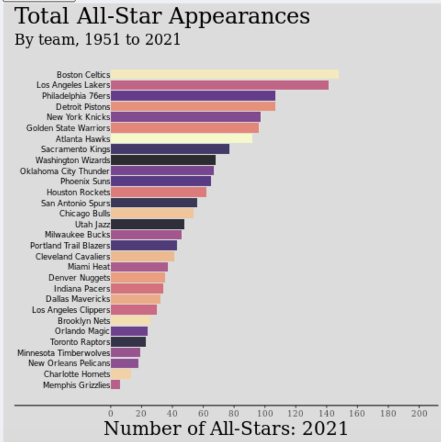
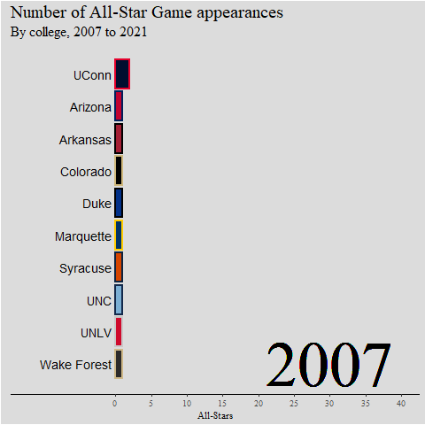
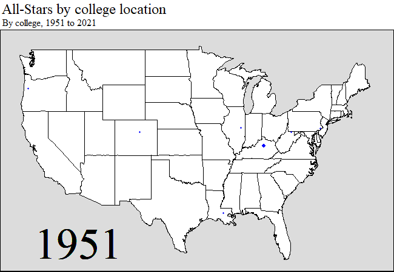

# Introduction

The NBA is an increasingly global league where its top talent comes from countries all over the world. Over the years, more of the NBA's All-Star talent have come from outside the US, which has brought along many fans globally. As fans of basketball, we were very interested in looking at how many NBA All-Stars come from countries other than the United States and how international talent has grown over the years.

In many professional sports, there is also the concept of "tanking" where teams that are not expected to do well begin to lose games on purpose to get a higher draft pick. For one of our research questions, we were interested in doing an analysis on whether earlier round draft picks were much more important in leading to players that make the All-Star game versus second round picks or undrafted players. Therefore, we could analyze and draw conclusions on whether the idea of "tanking" is valid for NBA teams or if they should just try to win as many games as they can. 

Another hypothesis we had was that a lot of the NBA's top talent comes from the same few organizations over the years (such as the Boston Celtics and LA Lakers). We were interested in exploring the number of All-Stars per team over the years to draw conclusions on the distribution of talent in the NBA.

Finally, as fans of college basketball as well we wanted to visualize which colleges had the most NBA All-Stars, as well as which states had the most colleges with top NBA talent. This could be used by NBA front offices as well to see which colleges produce the best NBA players, and will allow us to draw conclusions to see if the best NBA players typically come from prominent college basketball schools.

We built a Shiny app with interactive visualizations based on this NBA All-Star data that addressed all our hypotheses and ideas above, as well as looked at data that could help NBA team's more effectively make management decisions. We will answer each of our research questions, described with more depth below, with interactive visualizations in our Shiny app.

# Data

# Research Questions

1. Where are NBA All-Stars originally from geographically? How many All-Stars, on average, are there from outside the United States per year?

...

2. What proportion of NBA All-Stars were drafted in the first round of the NBA draft? Which teams did these All-Stars play for?

For our second question, we wanted to see how important early picks in the NBA draft are for finding the best players. We created an animated, racing bar chart to illustrate the number of All-Stars that were drafted in the first round, second round, or went undrafted and how that has shifted over the years. This could be used by NBA front offices to determine how important a first round pick is and how much a second round pick is really worth in trade scenarios. It was also interesting for us to look at how many undrafted All-Stars there have been, as we hypothesized that would be a very small percentage of the NBA's top talent.

We also wanted to see which teams have had the most cumulative All-Star selections, so we created an interactive plot to address the second part of this research question. This was interesting for our group as we hypothesized that there would be a significant difference in the number of All-Stars from larger markets (like Los Angeles, New York, and Miami) versus small market cities (such as Memphis or Minneapolis). We wanted to analyze if the location of cities plays a significant in attracting "All-Star" talent to the same few teams.

3. Which colleges did the most NBA players attend? Geographically, which regions in the US are those colleges in that produce the most NBA players?

....

# Question 1

- Which tabs are associated with this question
- Motivation!
- How did we clean
- Screenshots?
- What are our conclusions!

{width=50%}

{width=50%}

# Question 2

First, for the "Draft Positions" tab to clean up the data I had to create a new variable called "draft_range" that used the str_detect function to determine whether each NBA All-Star was a first round pick, second round pick, or went undrafted. I also created a new variable called "sum_all_stars" which I used to count how many All-Stars there were from draft category each year. 

Our Shiny app displays the distribution of which NBA draft picks cumulatively (over a range of years) are from each round of the draft or are undrafted. The distribution over the full range of years is illustrated below:

{width=50%}

As you can see above, from 1951 to 2021 there have been significantly more total All-Star appearances from first round picks compared to both second round picks and undrafted players. There have been ~1300 cumulative first round pick All-Star selections compared to ~200 from the secound round and ~150 undrafted All-Stars. This distribution demonstrated the importance of earlier draft picks as this plot shows that over 75% of All-Star selections come from the first round of the draft. This outcome could encourage the idea of "tanking" as, if bad teams lose on purpose, they could get earlier draft picks. However, despite the large majority of All-Star selections being from the first round, second round picks are often basically traded away for little to no value and do not hold much trade value. Our group concluded that NBA general managers should still hold some value on those picks, as, we felt that the distribution is large enough to demonstrate that those picks are worth holding onto. We concluded that it is also worth it for teams to consider picking up undrafted players, they are almost 10% of the NBA's All-Stars over the last 70 years and are often on much smaller contracts and are, therefore, low risk investments. However, more recently (as you can see by adjusting the range of years on the app) the proportion of second round picks and undrafted All-Star selections has decreased. For example, since 2010 there has not been any undrafted All-Star selections, which could signify that NBA teams are doing a better job drafting and undrafted players have less value than they did previously. 

Next, for the "Team" tab, we looked at the distribution of total All-Star appearances for each team over a range of years. First, as many teams have changed cities and/or names over the course of the last 70 years, I used the mutate variable to rename each team by their current name and city. For example, the Los Angeles Lakers used to be the Minneapolis Lakers, so I used the mutate function so the total All-Stars would all be shown under the name "Los Angeles Lakers". I also, similarly, created a new variable called "sum_all_stars" which I used after using the pivot functions to count how many All-Stars there were from draft category each year. Finally, for this chart I added a variable called "number_to_rank" that would allow the user to choose the number of teams he wants displayed. The default is set at all 30 teams, but if the user wanted a closer look at the teams with the most All-Stars, you could change the teams to range to 10, for example, and the app would only display the teams with the 10 most All-Stars cumulatively each year. The distribution over the full range of years is illustrated below:

As you could see in the plot above, the larger market teams (from bigger, more attractive cities) have had pretty significantly more All-Star selections than most of the smaller market teams. Four of the top five teams with the most total All-Star appearances are from bigger markets in Boston, LA, Philadelphia, and New York. The teams with the lowest amount of total All-Star appearances are from smaller market cities, including Memphis, Charlotte, New Orleans, and Minnesota. 

The difference in the distribution of All-Stars was more significant than we originally anticipated as well. For example, the Celtics and Lakers have both had over 140 All-Stars, while 22 of the 30 NBA teams have had less than 80 total All-Star appearances.

The total All-Star appearances could be explained by bigger markets, but also by managers building successful teams that resulted in more championships. The Lakers and Celtics have not only had the most All-Stars but they have had the most NBA championships. This is likely due to a combination of team and draft success, as well as their cities being attractive enough to bring in the best NBA players. The distribution of talent in the NBA clearly has not been even over the course of the league's history, and it is clear that the influence of cities that players may be more likely to want to play in plays a pretty significant factor in that distribution.

# Question 3

- Which tabs are associated with this question
- Motivation
- How did we clean
- Screenshots?
- What are our conclusions!

{width=50%}

{width=50%}

{width=50%}

{width=50%}

{width=50%}

{width=50%}

# Overall Conclusions

# NBA Players Geographical Data
