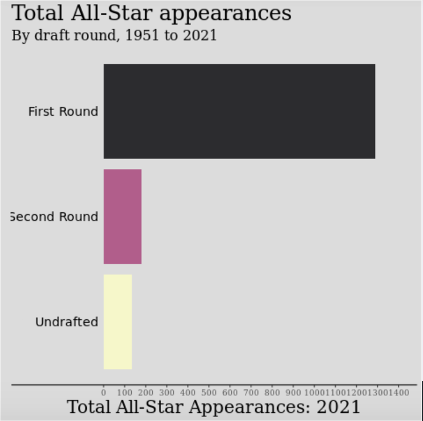
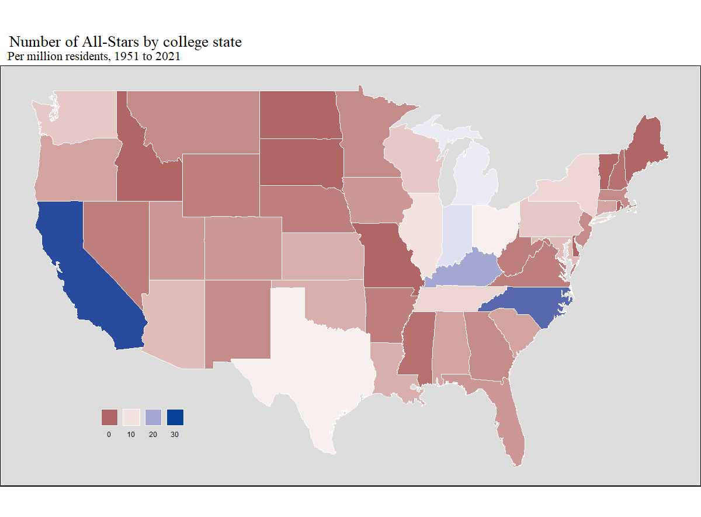

# Introduction

The NBA is an increasingly global league where its top talent comes from countries all over the world and colleges around the United States. Over the years, more and more of the NBA's All-Star talent have come from outside the United States, which has brought along many fans globally. As fans of basketball, we were very interested in looking at how many NBA All-Stars (or the NBA's best players) come from countries other than the United States and how international talent has grown over the years. Our Shiny app includes an interactive section that allows users to visualize where NBA All-Stars were from originally (that includes both a world map and a map of the US to see which states they are from) and see how that has changed over the years. This could also be used by NBA talent evaluators and general managers to see how important international scouting is and whether they should focus a lot of their attention going into an NBA draft on foreign players.

In many professional sports, there is also the concept of "tanking" where teams that are not expected to do well, start to lose games on purpose to get a higher draft pick. For one of our research questions, we were interested in doing an analysis on whether earlier round draft picks were much more important in leading to players that make the All-Star game versus second round picks or undrafted players. Therefore, we could analyze and draw conclusions on whether the idea of "tanking" is valid for NBA teams or if they should just try to win as many games as they can. 

Next, another hypothesis we had was that a lot of the NBA's top talent comes from the same few organizations over the years (such as the Boston Celtics and LA Lakers). One of the tabs in our Shiny app explored the number of All-Stars per team over the years to draw conclusions on the distribution of talent in the NBA.

Finally, as fans of college basketball as well we wanted to explore which colleges had the most NBA All-Stars, as well as which states had the most colleges with top NBA talent too. This could be used by NBA talent evaluaters and front offices as well to see which colleges produce the best NBA players and will allow us to draw conclusions to see if the best NBA players come from prominent college basketball schools, such as Duke or Kentucky, or from colleges that aren't as consistently good at basketball.

We built a shiny app with visualizations based on this NBA All-Star data that addressed all our hypotheses and ideas above, as well as looked at data that could help NBA team's more effectively make management decisions. We will answer each of our research questions, described with more depth below, with interactive visualizations in our Shiny app.

# Research Questoins

1. Where are NBA All-Stars originally from geographically? How many All-Stars, on average, are there from outside the United States per year?

.....

2. What proportion of NBA All-Stars were drafted in the first round of the NBA draft? Which teams did these All-Stars play for?

For our second question, we addressed the proportion of NBA All-Stars were drafted in the first round, as we wanted to see how important early picks in the NBA draft are for finding the best players. We created an animated, racing bar chart for this chart to illustrate the number of All-Stars that were drafted in the first round, second round, or went undrafted and how that has shifted over the years. This could be used by NBA front offices to determine how important a first round pick is and how much a second round pick is really worth in trade scenarios. It was also interesting for us to look at how many undrafted All-Stars there have been, as we hypothesized that would be a very small percentage of the NBA's top talent.

We also wanted to see which teams have had the most cumulative All-Star selections over the years, so we created an interactive plot to address the second part of this research question as well. This was interesting for our group as we hypothesized that there would be a very significant difference in the number of All-Stars from larger markets (like Los Angeles, New York, and Miami) versus small market cities (such as Memphis, Minneapolis, and Salt Lake City). We wanted to analyze how significant it is for cities to attract "all-star" talent and therefore if most of the top talent over the years have come from the same few NBA teams.  

3. Which colleges did the most NBA players attend? Geographically, which regions in the US are those colleges in that produce the most NBA players?

....

# Question 1

- Which tabs are associated with this question
- Motivation!
- How did we clean
- Screenshots?
- What are our conclusions!

# Queston 2

The two tabs associated with this question are in our Shiny app are "Draft Positions" and "Team".

First, for the "Draft Positions" tab to clean up the data I had to create a new variable called "draft_range" that used the str_detect function to determine whether each NBA All-Star in the "all_stars.csv" dataset was a first round pick, second round pick, or was undrafted. I also created a new variable called "sum_all_stars" which I used after using the pivot functions to count how many All-Stars there were from draft category each year. 

Our Shiny app displays a clear distribution of which NBA draft picks cumulatively over a range of years (that are interactively chosen by the user) are from each round of the draft or are undrafted. The distribution over the full range of years is illustrated below:

As you can see above, from 1951 to 2021 there have been significantly more total All-Star appearances from first round picks compared to both second round picks and undrafted players over the full range of years. There have been about 1300 cumulative first round pick All-Star selections compared to about 200 from the secound round and only about 150 undrafted All-Stars. This distribution could be very important for NBA management decisions and illustrated a critical and interesting outcome for our group's benefit. First, it demonstrates the importance of earlier draft picks as this plot shows that over 75% of All-Star selections come from the first round of the draft. This outcome could encourage the idea of "tanking" as if bad teams lose on purpose, they could get earlier draft picks. However, despite the large majority of All-Star selections being from the first round, second round picks are often basically traded away for little to no value and do not hold much trade value, and our team has concluded that NBA general managers should still hold some value on those picks. Despite only 200 All-Star selections being from the second round over the last 70 years, we felt that is still large enough to demonstrate to management that those picks are worth holding onto. This chart also displays that it is often worth it for teams to consider picking up players after the draft if they go undrafted. Many teams do not consider adding players to their team that do not get drafted, but, considering that almost 10% of the NBA's top talent has not been drafted over the last 70 years, we think it is very important for teams to pick up undrafted players, especially due to the fact that they are often on much smaller contracts and are low risk investments for teams. However, more recently (as you can see by adjusting the range of years on the app) the proportion of second round picks and undrafted All-Star selections has decreased. For example, since 2010 there has not been any undrafted All-Star selections, which could signify that NBA teams are doing a better job drafting and undrafted players have less value than they did previously. 

# Question 3

- Which tabs are associated with this question
- Motivation
- How did we clean
- Screenshots?
- What are our conclusions!

# Overall Conclusions

# NBA Players Geographical Data

This project intends to use a Shiny app to examine where NBA players and NBA All-Stars originate from. It will showcase both players' hometowns and the location of their college. Our project proposal is found in the Proposal folder.